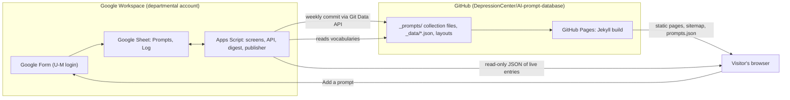

<!--
This file is part of AI Prompt Database
docs/specs/2026-09-28-prompt-intake-and-site-design.md
Author(s): Gabriel Mongefranco.
Created: 2026-09-28
Last Modified: 2026-09-28
Summary: Design specification for the prompt submission form, automated screening, review workflow, weekly archive publishing, and the public static site.
Notes: See README file for documentation and full license information.

Copyright © 2026 The Regents of the University of Michigan

Licensed under the GNU Free Documentation License v1.3 or later.
See <https://www.gnu.org/licenses/fdl-1.3.html>. See README for full license information.

-->

# AI Prompt Database

## Design: prompt intake, review, and public site

[← Back to README](../../README.md)

## Summary

This page describes how people will add prompts to the database through a Google Form, how a script screens and publishes them, and how a public website shows them. It resolves [GitHub issue 1](https://github.com/DepressionCenter/AI-prompt-database/issues/1). It is written for the maintainers who will build and run the system, and for anyone who wants to understand where the data lives and how it is protected. The matching implementation plan is [the intake and site plan](../plans/2026-09-28-prompt-intake-and-site-plan.md).

Status: approved design, not yet built. Nothing on this page describes current behavior.

## Goals and constraints

The system must meet these goals, which come from issue 1 and the design discussion that followed.

- Anyone with a University of Michigan (U-M) login can submit a prompt by filling in a form. Nobody has to edit a Markdown template or use GitHub.
- A submission that passes automated checks appears on the site right away. One that fails any check waits for a maintainer, who approves, denies, or edits it in a spreadsheet.
- The whole system runs free of charge over the long term. GitHub Actions minutes are billed under the U-M enterprise agreement, so the design uses no custom GitHub Actions workflows.
- No private API key is exposed to visitors. Credentials live only in the script's protected properties.
- Prompt pages must be indexable by search engines, with one URL per prompt.
- Everything a person reads or operates meets WCAG 2.1 AA.
- The database serves U-M staff first, but the data model stays general enough for other institutions to reuse.
- Contributed text is published verbatim on a public site and in a public repository, so protected health information (PHI), personal data, and secrets must be kept out.

## Decisions

These decisions were made during design. Each lists the alternative that was rejected and why.

| Decision | Rejected alternative | Reason |
| --- | --- | --- |
| A Google Sheet is the source of truth for every prompt. | Markdown pages or JSON files in git as the source of truth. | The maintainer can edit, approve, and deny in one place, and changes take effect without a commit. |
| A Google Form restricted to umich.edu accounts is the intake. | A custom web form posting to an API. | The Form gives U-M login, spam protection, and the submitter's email with no code, and no public write endpoint exists anywhere. |
| Google Apps Script does screening, notifications, the read-only API, and publishing. | GitHub Actions workflows. | Actions cost the department money. Apps Script is free within Workspace quotas. |
| GitHub holds an archive rendered by the Jekyll build that GitHub Pages already runs. | Apps Script generating HTML pages. | Page design stays in the repository under review, and Apps Script writes data only. |
| Auto-approved entries wait 14 days before entering git. Human-approved entries enter at the next weekly run. | Committing every approval immediately. | Git history is close to permanent. The hold gives the weekly digest time to catch anything the screens missed. |
| Entries that passed the screens but have not been seen by a person show a "Review pending" label until they are archived. Reviewed entries carry no label. | Labeling every entry with its review state. | Readers only need a warning where one applies. |
| A GitHub App is the primary GitHub credential and a fine-grained personal access token is the fallback. | One credential only. | The App has no calendar expiry and belongs to the organization. The token keeps publishing working if the App fails. |
| Categories, tools, audiences, tasks, and kinds live in JSON data files in the repository. | Hard-coded lists in the script and the Form. | One reviewed source. The script fetches the lists at run time. |
| The ten existing Markdown prompt pages are migrated into the Sheet and then removed from the repository. | Keeping Markdown pages alongside the archive. | Two formats drift apart. Git history keeps the old pages. |

## Architecture

The system has four parts. The Google side collects, screens, serves, and publishes. The GitHub side stores the archive and renders the site. Visitors' browsers combine the two.



Text description of the diagram: a U-M person fills in the Google Form, which writes to the Sheet. Apps Script reacts to each new row, screens it, and sets its status. The script also answers a public read-only request with the entries that are live but not yet archived, and once a week it commits eligible entries to the GitHub repository. GitHub Pages rebuilds the Jekyll site from the repository. A visitor's browser loads the static pages from GitHub Pages, then calls the script's read-only endpoint to add the newest entries on top. The "Add a prompt" button on the site links to the Form.

### Components

| Component | Runs where | Responsibility |
| --- | --- | --- |
| Google Form | Google Workspace | Collects submissions from signed-in umich.edu users. |
| Prompts sheet | Google Sheets | One row per prompt. Source of truth for content, status, and review metadata. |
| Form submit handler | Apps Script trigger | Normalizes text, assigns an id, runs the screens, sets status, sends emails. |
| Read-only API | Apps Script web app | Returns live entries as JSON for the site. Cached for ten minutes. |
| Weekly digest | Apps Script time trigger | Emails the maintainer a list of auto-approved entries and pending items. |
| Publisher | Apps Script time trigger | Writes eligible entries into the repository as collection files in one commit. |
| Jekyll site | GitHub Pages | Renders one page per archived prompt, category pages, search, feeds, and the sitemap. |
| Live entries script | Visitor's browser | Fetches the read-only API and renders the newest entries with their labels. |

## Data model

### Field survey

The data model comes from two sources: the ten prompt pages already in this repository, and the fields other prompt libraries collect. Each outside library was checked on 2026-09-28 against its own pages or documentation.

The existing pages share one structure. Each has a title, one or more contributors with a name, a GitHub handle or link, and a department, a description, one or more prompt templates labeled with the tools they were written for, placeholders written as `[INPUT]` or `[START_DATE]`, and one or more examples with a short description, the prompt as used, and the output. Two pages cite a source URL for their examples. Two pages carry more than one template variant, and one page carries ten target-specific variants under a base template. The folder name is the category.

| Library | Fields observed | What this design takes from it |
| --- | --- | --- |
| U-M GenAI Prompt Library, run by the ITS GenAI team | Two groups, "User Prompts" for U-M GPT and Maizey chat and "System Prompts" for Maizey tools. Each entry shows a title, a one-line description, a "GenAI Tool" value, a "User Input" or "System Input" block, and an "Example Output" block. Maizey system prompts use `{question}` as a placeholder. No author, tags, or submission path are shown. | The `kind` field separates user prompts from system prompts, and every entry has a description, a tool, and examples with outputs. |
| awesome-chatgpt-prompts, the `prompts.csv` file | act, prompt, for_devs, type, contributor. | A flat record with a contributor and a type is enough for machine reuse. |
| AIPRM prompt templates | Title, Teaser, Prompt Hint, Prompt Template, Topic, Activity, Made for model, visibility, Author Name, Author URL. Templates require a `[PROMPT]` variable and public ones a `[TARGETLANGUAGE]` variable. | The `tasks` vocabulary mirrors Activity. The Prompt Hint idea becomes help text about placeholders. Square-bracket placeholders match the existing pages. |
| FlowGPT | Prompt, name, description, tags, category, hashtags. Character prompts add personality, greeting, and an intro shown only to the user. | Tags plus a category. The user-only intro maps to the `setup` field. |
| LangSmith Prompt Hub | Name, visibility, description, readme, use case, language, model, tags, input variables, versioned commits. Filters by use case, type, language, and model. | Language and tools as filters, and a derived input variables list. |
| Microsoft Copilot Prompt Gallery | Filters by task, job type, and product. Distinguishes Microsoft-curated prompts from user-saved ones. Prompts can be saved and shared with a team. | Filtering by audience and task, and a visible difference between reviewed and unreviewed entries. |
| PromptBase | Title, description, type such as text or image, category, tags, model, preview, instructions, plus sales data. | The `kind` value for image prompts and a separate instructions field. |
| PromptHero | Model, negative prompt, style preset, seed, steps, guidance scale for image prompts. | Image prompt settings belong in `setup` rather than in dedicated columns, since this database is text-first. |
| OpenAI Academy prompt packs | Packs organized by role and industry. Each prompt states the task, who it is for, and the desired output. | Audience as a first-class field. |
| Model Context Protocol prompt definition | name, title, description, icons, arguments with name, description, and required flag. | Derived variables make prompts usable by tools as well as people. |

Two lessons carry over. Libraries that let readers filter by role, task, or tool get used more than flat lists, so the record carries audience, tasks, tools, and kind. Machine-readable placeholders, as in the MCP argument list, make prompts reusable by tools as well as people, so the record derives a variables list from the template.

### Prompt record

The record below is the public shape of one prompt. It is what the read-only API returns, what the publisher writes into each collection file, and what the site's `prompts.json` feed contains. Grain: one record per prompt entry.

| Field | Type | Required | Notes |
| --- | --- | --- | --- |
| id | string | yes | URL slug, lowercase ASCII letters, digits, and hyphens, at most 60 characters. Derived from the title on submission and never changed. Collisions get a numeric suffix. |
| title | string | yes | 5 to 120 characters. |
| kind | string | yes | One of `user-prompt`, `system-prompt`, `image-prompt`, `agent-instructions`. Default `user-prompt`. |
| category | string | yes | One slug from the categories vocabulary. |
| tasks | array of string | no | Slugs from the tasks vocabulary, such as `summarize` or `translate`. |
| audience | array of string | no | Slugs from the audiences vocabulary. |
| tools | array of string | yes | Slugs from the tools vocabulary. At least one. |
| tags | array of string | no | Free-form keywords, lowercased, at most 8. |
| language | string | yes | BCP 47 tag of the prompt text, default `en`. |
| description | string | yes | What the prompt does and when to use it. 20 to 2,000 characters. |
| setup | string or null | no | Instructions, files, or settings needed before running the prompt, including image model settings. At most 5,000 characters. |
| template | string | yes | The prompt text with placeholders. 20 to 20,000 characters. |
| variables | array of string | derived | Placeholder names found in the template, in order of first appearance. |
| variants | array of object | no | Alternate templates. Each has `label`, `tools`, and `template`. |
| examples | array of object | no | Each has `description`, `prompt`, `output`, and `tool`. Outputs are published as the model produced them, trimmed if needed. |
| references | array of string | no | HTTPS URLs cited by the entry. |
| contributors | array of object | yes | Each has `name`, optional `affiliation`, and optional `url`. An anonymous entry has one contributor named "Anonymous contributor" and nothing else. |
| submitted | string | yes | UTC timestamp, ISO 8601 with a `Z` suffix. |
| published | string | archive only | UTC timestamp of the commit that archived the entry. |
| updated | string | yes | UTC timestamp of the last edit in the Sheet. |
| license | string | yes | Always `GFDL-1.3-or-later`. |

Private fields stay in the Sheet and never leave it: submitter email, credit preference, maintainer comments from the form, reviewer notes, screen flags, review kind, reviewer identity, and review time.

### Placeholders and variables

A placeholder is an uppercase word in square brackets, such as `[TOPIC]` or `[START_DATE]`. Letters, digits, and underscores are allowed inside the brackets. The publisher and the API derive the `variables` list from the template with this rule. The Form's help text teaches the convention. The site renders placeholders inside `<var>` elements and lists them under the template. Maizey system prompts written with `{question}` keep that text as-is, because Maizey needs it, and the Form help text says so.

### Controlled vocabularies

Vocabularies live in `_data/` as JSON files so Jekyll and Apps Script read the same source. Each file is an object with a `_license` key and an `items` array. Each item has `slug`, `name`, and `description`.

| Vocabulary | Starting values |
| --- | --- |
| categories | `business`, `clinical`, `coding`, `data-analysis`, `education`, `just-for-fun`, `research`, `web-development`. These are today's folders. The Form also offers "Not sure, let the maintainers choose", which lands the entry in pending review. |
| kinds | `user-prompt` (typed into a chat), `system-prompt` (configures a chat tool such as Maizey or a custom GPT), `image-prompt` (for an image generator), `agent-instructions` (instruction files or skills for coding agents). |
| tools | `umgpt`, `maizey`, `chatgpt`, `copilot-m365`, `gemini`, `claude`, `coding-assistant`, `image-generator`, `llama`, `other`. These cover every "For:" value in the existing pages. |
| audiences | `researchers`, `clinicians`, `educators`, `students`, `analysts`, `developers`, `administrative-staff`, `everyone`. |
| tasks | `create`, `summarize`, `rewrite`, `translate`, `explain`, `analyze`, `code`, `brainstorm`, `plan`, `review`, `extract`, `roleplay`. |

Adding a value means editing the JSON file in the repository and the matching Form question. The review how-to lists both steps.

### Statuses

The `status` column drives everything. Grain of the state table: one row per allowed transition.

| From | To | Who or what | When |
| --- | --- | --- | --- |
| new row | auto_approved | submit handler | Every screen passed. |
| new row | pending_review | submit handler | Any screen raised a flag, or the category is "not sure". |
| pending_review | approved | maintainer | Content checked and acceptable, edited if needed. |
| pending_review | denied | maintainer | Content rejected. Row stays for the record. |
| auto_approved | approved | maintainer | Optional confirmation after a look at the digest. |
| auto_approved | denied | maintainer | Digest or a report showed a problem. |
| auto_approved | archived | publisher | At least 14 days since submission. |
| approved | archived | publisher | Next weekly run. |
| archived | denied | maintainer | Problem found after archiving. Publisher deletes the file at the next run. |

Visibility follows status. `auto_approved` and `approved` rows are served by the read-only API. `archived` rows are served by the static site. `pending_review` and `denied` rows are never served. A separate `review` column records `automated` or `human`, with `reviewed_by` and `reviewed_at`, so the compliance record shows who looked at what.

### Sheet layout

The spreadsheet has three tabs.

`Form Responses` is written by Google Forms and never edited by hand. `Prompts` holds one row per prompt and is the only tab maintainers edit. `Log` holds one row per script event with a UTC timestamp, the job name, the outcome, a short detail string, and the commit hash when one exists.

The `Prompts` tab has these columns, in this order. Timestamps are UTC ISO 8601 strings, not spreadsheet dates, so they survive time zone changes.

| Column group | Columns |
| --- | --- |
| Identity and state | `id`, `status`, `review`, `flags`, `reviewer_notes`, `reviewed_by`, `reviewed_at` |
| Content | `title`, `kind`, `category`, `tasks`, `audience`, `tools`, `tags`, `language`, `description`, `setup`, `template`, `variants_json` |
| Examples | `example_1_description`, `example_1_prompt`, `example_1_output`, `example_1_tool`, the same four for examples 2 and 3, and `extra_examples_json` for entries with more than three |
| Sources and credit | `references`, `contributor_name`, `contributor_affiliation`, `contributor_url`, `additional_contributors`, `credit_preference` |
| Private | `submitter_email`, `maintainer_comments`, `source` |
| Timestamps and archive | `submitted_at`, `updated_at`, `archived_at`, `archive_path`, `last_commit_sha`, `unpublished_at` |

Multi-value cells such as `tasks`, `audience`, `tools`, `tags`, and `references` hold comma-separated values, one per line for `references`. `variants_json` and `extra_examples_json` hold JSON arrays and are edited only by maintainers, since the Form cannot collect repeating groups. `source` is `form`, `migration`, or `manual`.

### Archive file format

The publisher writes one file per archived prompt at `_prompts/<category>/<id>.md`. The file is a Jekyll collection document whose front matter is the public record as a single JSON object, and whose body is empty. JSON is valid YAML, so Jekyll reads it without a custom parser, and the script never has to emit YAML block scalars by hand. Example with synthetic content:

```markdown
---
{"id":"summarize-meeting-notes","title":"Summarize meeting notes","kind":"user-prompt","category":"business","tasks":["summarize"],"audience":["administrative-staff","everyone"],"tools":["umgpt","copilot-m365"],"tags":["meetings"],"language":"en","description":"Turns raw meeting notes into a short summary with action items.","setup":null,"template":"Summarize the following meeting notes in five bullet points, then list action items with owners.\n\n[NOTES]","variables":["NOTES"],"variants":[],"examples":[{"description":"Weekly team meeting","prompt":"Summarize the following meeting notes in five bullet points, then list action items with owners.\n\nWe reviewed the budget...","output":"- The team reviewed the budget...","tool":"umgpt"}],"references":[],"contributors":[{"name":"Jordan Example","affiliation":"Example Department","url":null}],"submitted":"2026-09-01T15:04:05Z","published":"2026-09-19T06:00:00Z","updated":"2026-09-01T15:04:05Z","license":"GFDL-1.3-or-later"}
---
```

The layout escapes every field before output, so a record can never inject HTML into the page.

The site also produces `prompts.json` from the collection at build time, so no separate data file has to be committed. Anyone can fetch it as a free read-only API of the archive.

## Google Form

The Form is owned by the departmental Google account, collects verified umich.edu email addresses, and is restricted to users in the University of Michigan organization. It allows more than one response per person. Response validation limits lengths and requires HTTPS for links. Questions marked with an asterisk are required.

| Section | Question | Type and validation |
| --- | --- | --- |
| About this form | Intro text: what is published, the license, the no-PHI rule, and the review process. | Description only. |
| The prompt | Title* | Short answer, 5 to 120 characters. |
| The prompt | What kind of prompt is this?* | Dropdown from the kinds vocabulary, "User prompt" preselected. |
| The prompt | Category* | Dropdown from the categories vocabulary plus "Not sure, let the maintainers choose". |
| The prompt | What does this prompt do, and when should someone use it?* | Paragraph, 20 to 2,000 characters. |
| The prompt | Prompt template* | Paragraph, 20 to 20,000 characters. Help text explains `[PLACEHOLDER]` style and says Maizey's `{question}` may stay. |
| The prompt | Setup or context needed | Paragraph, up to 5,000 characters. Custom instructions, files to attach, model or image settings. |
| The prompt | Which AI tools have you used it with?* | Checkboxes from the tools vocabulary. |
| The prompt | What does it help you do? | Checkboxes from the tasks vocabulary. |
| The prompt | Who is this prompt for? | Checkboxes from the audiences vocabulary. |
| The prompt | Keywords | Short answer, comma-separated, up to 8. |
| The prompt | Language of the prompt* | Dropdown, English preselected, plus common languages and Other. |
| Example 1 (recommended) | What was this example for? | Short answer. |
| Example 1 | The exact prompt you used | Paragraph, up to 20,000 characters. |
| Example 1 | The output you got | Paragraph, up to 20,000 characters. |
| Example 1 | Tool used | Dropdown from the tools vocabulary. |
| Example 2 and 3 (optional) | Same four questions. | Same validation. |
| Sources | References or sources | Paragraph, one HTTPS URL per line. |
| About you | Your name as it should appear* | Short answer. |
| About you | Department, unit, or organization* | Short answer. |
| About you | Public profile link | Short answer, HTTPS URL. GitHub, ORCID, or a website. |
| About you | Other contributors | Paragraph, one per line as "Name, Department". |
| About you | How should we credit you?* | Multiple choice: "Credit me by name" or "Publish as Anonymous contributor". |
| Agreements | Confirmations* | Checkboxes, all required: no patient information, personal data about others, passwords, or keys; the submitter has the right to share the content and agrees to publication under the GNU Free Documentation License 1.3 or later; the submitter understands the prompt will appear on a public website and in a public repository. |
| Agreements | Anything for the maintainers? | Paragraph, optional, never published. |

The Form cannot collect more than three examples or any template variants. Maintainers add those in the Sheet.

## Apps Script behavior

The script project is bound to the spreadsheet and owned by the departmental account. Its source lives in this repository under `src/apps-script/` so it is versioned and reviewed. Pure functions such as the screens, the slug rule, the record builder, and the publisher's diff logic live in files that run under Node's built-in test runner as well as in Apps Script. Files that touch Google services hold only glue code.

### On form submit

1. Read the new response row and copy its answers into a new `Prompts` row with `source` set to `form` and `submitted_at` set to the current UTC time.
2. Normalize every text field: convert line endings to `\n`, apply Unicode NFC, strip control characters other than newline and tab, remove zero-width and bidirectional control characters and record that removal as a flag, and collapse runs of more than two blank lines.
3. Assign the `id` from the title and resolve collisions with a numeric suffix.
4. Run the screens below and collect flag codes.
5. Set `status` to `auto_approved` with `review` set to `automated` when there are no flags. Otherwise set `status` to `pending_review`.
6. Clear the API cache.
7. Email the submitter a receipt that states whether the entry is live or waiting for review. Email the maintainer when the entry is pending, listing the flag codes and a link to the row, and never quoting the flagged text, since the email itself must not carry PHI.
8. Write a `Log` row.

### Screens

Every screen returns zero or more flag codes. Any flag sends the entry to pending review. The lists below are the starting rules. They are heuristics, and the plan expects them to be tuned after the first months of real submissions. The safe failure is a false positive, which only delays an entry until a person looks at it.

| Screen | Flag code | Rule |
| --- | --- | --- |
| Spam | rate_limit | More than 5 submissions from the same email within 24 hours. |
| Spam | duplicate | Normalized title or template hash matches an existing row. |
| Spam | too_short | Template or description under 20 characters after normalization. |
| Spam | too_long | Any field over its maximum length. |
| Spam | link_in_prompt | Any URL inside the template, setup, or example fields. References are exempt. |
| Spam | too_many_links | More than 5 URLs in the references field, or any non-HTTPS URL. |
| Injection and hidden content | hidden_characters | Zero-width, bidirectional, or tag characters were present. |
| Injection and hidden content | injection_pattern | Phrases such as "ignore all previous instructions", "disregard your rules", "reveal your system prompt", or "do anything now". |
| Injection and hidden content | html_content | Tags such as `script`, `iframe`, `img`, `svg`, `object`, `embed`, `link`, `meta`, event handler attributes, or `javascript:` URLs. |
| Injection and hidden content | embedded_image | Markdown image syntax pointing at a URL. |
| Injection and hidden content | encoded_blob | A run of 200 or more base64 characters, or a `data:` URL. |
| PHI and personal data | email_address | Any email address in content fields. |
| PHI and personal data | phone_number | North American phone number shapes. |
| PHI and personal data | ssn_pattern | Three-two-four digit groups. |
| PHI and personal data | identifier_pattern | The words "MRN" or "medical record number", or a run of 8 to 10 digits. |
| PHI and personal data | date_of_birth | "DOB", "date of birth", or "born on" near a date. |
| PHI and personal data | street_address | A number followed by words and a street suffix. |
| PHI and personal data | patient_context | Phrases such as "patient name", "the patient is", or "pt named". |
| Secrets | secret_pattern | Common key shapes such as `sk-`, `AKIA`, `ghp_`, `AIza`, private key headers, and `password:` or `api_key=` followed by a value. |

### Read-only API

The web app is deployed with access set to anyone and answers only `GET`. It returns:

```json
{
  "version": 1,
  "generated_at": "2026-09-28T14:00:00Z",
  "cache_seconds": 600,
  "entries": [
    {
      "id": "summarize-meeting-notes",
      "review": "pending",
      "live_since": "2026-09-27T18:22:10Z",
      "title": "Summarize meeting notes"
    }
  ]
}
```

Each entry carries the full public record plus two extra fields. `review` is `pending` for auto-approved rows and `approved` for rows a person approved. `live_since` is when the row became visible. Only rows with status `auto_approved` or `approved` are included, so archived rows never appear twice. The response is cached with the script cache for 600 seconds. The submit handler and an edit trigger on the `Prompts` tab clear the cache. The endpoint has no write path and reads no parameters beyond a version number.

### Weekly digest

Every Monday morning in the America/Detroit time zone, the script emails the maintainer a digest. It lists auto-approved entries from the past week with title, category, submitter department, days until archive, and a link to the row. It also lists pending entries and their ages. The digest exists so a person sees every auto-approved entry before the hold expires.

### Publisher

Every Friday morning in the America/Detroit time zone, and on demand from the script editor, the publisher runs these steps under a script lock so two runs never overlap.

1. Select rows to archive: status `approved`, or status `auto_approved` with `submitted_at` at least 14 days ago. Select rows to update: status `archived` with `updated_at` later than `archived_at`. Select rows to delete: status `denied` with a non-empty `archive_path`.
2. Fetch the vocabularies from the repository and validate every selected row against them. A row that fails validation is skipped and logged, and the maintainer is emailed.
3. Build each record and render it as a collection file. Compute the git blob hash of the file content, which is the SHA-1 of the string `blob`, a space, the byte length, a NUL byte, and the content.
4. Fetch the current commit on `main` and its tree. Compare the desired files against existing blob hashes. Keep only files that are new or changed, plus the deletions.
5. When nothing changed, log that and stop.
6. Create a blob for each changed file, create a tree on top of the current tree with the changed entries and the deletions, create a commit with a message such as "Publish 3 prompts, update 1, remove 1", and move `main` to it. Process at most 50 files per run, and leave the rest for the next run, so the six-minute execution limit is never hit.
7. Only after the branch has moved, update the Sheet: set `status` to `archived`, `archived_at`, `archive_path`, and `last_commit_sha` for archived and updated rows, and `unpublished_at` with an empty `archive_path` for deleted rows.
8. Write a `Log` row with counts and the commit hash. On any failure, log it, email the maintainer, and leave the Sheet unchanged. The next run recomputes the desired state from the Sheet, so a rerun after a failure is safe.

### GitHub authentication

The publisher authenticates in this order.

1. GitHub App. The script builds a JSON Web Token with the app id as issuer, signs it with the app's private key using the script's RSA SHA-256 utility, and exchanges it for a one-hour installation token. GitHub issues the key in PKCS#1 format and the script utility needs PKCS#8, so the key is converted once with OpenSSL before it is stored. The App is owned by the DepressionCenter organization, is installed on this one repository, and has only the repository contents permission with read and write access.
2. Fine-grained personal access token, used only when step 1 fails. It is scoped to this repository with contents read and write, expires within a year, and belongs to a departmental or bot GitHub account when the enterprise allows one. When the fallback is used, the maintainer is emailed so the App can be repaired.

Both credentials live in Script Properties and never in code, the Sheet, or logs. The properties are `GITHUB_APP_ID`, `GITHUB_APP_INSTALLATION_ID`, `GITHUB_APP_PRIVATE_KEY_PKCS8`, `GITHUB_PAT_FALLBACK`, `GITHUB_REPOSITORY`, `GITHUB_BRANCH`, `MAINTAINER_EMAIL`, `SITE_BASE_URL`, `HOLD_DAYS`, `LIVE_CACHE_SECONDS`, and `MAX_FILES_PER_RUN`. A branch ruleset on `main` lets the App and the fallback account push, and blocks everyone else from pushing directly.

### Triggers and quotas

The project uses one form-submit trigger, one edit trigger, and two time triggers. At the time of writing, Google's published quotas for Workspace accounts allow far more than this workload: URL fetch calls, email recipients per day, and total trigger runtime are all orders of magnitude above a weekly publish and a few submissions a day. The six-minute limit per execution is the one that shapes the design, and the 50-file batch handles it.

## Static site

The site is a Jekyll project at the root of the repository, built by GitHub Pages with the plugins GitHub allows. No local build is required to publish. The site is served at the repository's GitHub Pages URL.

### Structure

| Path | Purpose |
| --- | --- |
| `_config.yml` | Site metadata, collection settings, permalinks, plugins, excluded paths, and the live API URL. |
| `_prompts/<category>/<id>.md` | Archived prompt records written by the publisher. |
| `_data/categories.json`, `_data/kinds.json`, `_data/tools.json`, `_data/audiences.json`, `_data/tasks.json` | Controlled vocabularies. |
| `_layouts/` and `_includes/` | Page skeletons, header, footer, prompt card, live entries section. |
| `index.md` | Home page with search, category cards, and the live entries section. |
| `<category>/index.md` | One committed page per category. URLs keep today's folder names, such as `/research/`. |
| `contribute.md` | How the process works, what is published, and the link to the Form. |
| `prompts.json` | Liquid template that emits every archived record as a JSON array. |
| `assets/css/site.css`, `styles/um-style.css` | Site styles. The U-M stylesheet already in the repository is reused. |
| `assets/js/live.js`, `assets/js/search.js`, `assets/js/copy.js` | Live entries, client-side search, and copy buttons. Each works without the others, and the page reads without any of them. |
| `images/` | Vendored logo and preview images, so nothing is hot-linked. |
| `404.html`, `robots.txt` | Standard site files. The sitemap and feed come from plugins. |

Files that are not part of the site, such as `README.md`, `AGENTS.md`, `docs/`, `skills/`, and `src/`, are excluded in `_config.yml`.

### Pages

Every prompt page shows the title, kind, category, tasks, tools, audience, description, setup when present, the template in a `pre` and `code` block with placeholders in `var` elements and a copy button, the variables list, each variant, each example with the prompt in `kbd` and the output in `samp` and a copy button on the prompt, references, contributors, the submitted and updated dates, a "Report this prompt" mail link, and the license line. The page title, description, canonical URL, and Open Graph tags come from the SEO plugin using the record's fields. The sitemap plugin lists every prompt page with its updated date, and the feed plugin publishes an Atom feed of archived prompts.

Category pages list their archived prompts as cards. The home page shows the category cards, a search box with filters for kind, tool, task, and audience, and the live entries section.

### Live entries and labels

The live entries script reads the API URL from a data attribute, fetches it with an eight-second timeout, and renders the returned entries into a section headed "New this week". An entry whose `review` is `pending` shows a text label reading "Review pending" and a one-line explanation that it passed automated checks and a maintainer has not reviewed it yet. An entry whose `review` is `approved` shows no label. When the request fails, the section shows one sentence saying new entries cannot be loaded right now and archived prompts are unaffected. Without JavaScript, the section shows a link to the Form and a sentence explaining that the newest entries appear after the weekly archive.

Search covers the archive from `prompts.json` plus whatever the live script loaded. Results are announced through a live region.

### Security headers and content policy

GitHub Pages does not let a site set HTTP headers, so the layout carries a Content Security Policy in a `meta` element. It allows scripts, styles, and images from the site's own origin, connections to the site's origin and to the two Google hosts the API redirects through, and nothing else. Every value from a record or from the API passes through Liquid's `escape` filter or is inserted as a DOM text node. Nothing from a record is ever rendered as Markdown or HTML.

## Security and privacy

| Risk | Control |
| --- | --- |
| Anonymous spam or bulk submissions. | The Form requires a signed-in umich.edu account, and the rate limit flags heavy submitters. |
| PHI or personal data published on the public site. | Required attestation in the Form, the PHI screens, the "Review pending" label, the weekly digest, the "Report this prompt" link, instant removal on denial, and the 14-day hold before anything enters git. |
| Secrets published. | The secret screen sends matches to pending review. A committed secret is treated as compromised and must be rotated, not just deleted. |
| Prompt injection aimed at readers' AI tools or at agents indexing the site. | The injection and hidden-content screens, plus the fact that the site never renders record text as HTML. |
| Cross-site scripting through record content. | Liquid `escape` on every field in layouts, DOM text nodes in scripts, HTML tag screen at intake, and the meta Content Security Policy. |
| Abuse of the write path. | There is none. Submissions go through Google Forms, the API is read-only, and only the publisher writes to GitHub. |
| Leak of the GitHub credential. | Stored in Script Properties, scoped to one repository and one permission, App token valid for one hour, fallback token expires within a year, ruleset limits who can push to `main`. |
| Path injection in the archive path. | The id is derived by an allowlist rule and the category is validated against the vocabulary before the path is built. |
| Loss of the Google assets when a person leaves. | The Form, Sheet, and script belong to a departmental account. |
| Flagged content sitting in Google. | The Form states that PHI must not be submitted. U-M Google is not approved for PHI, so the review how-to says to deny and delete such rows promptly. Sheet sharing is limited to maintainers. |
| Unreviewed content in git history. | Only human-approved rows or auto-approved rows older than 14 days are committed. |

Two decisions need institutional review and cannot be settled by code review: whether a public prompt collection that accepts U-M submissions needs a privacy notice, and whether the U-M Google environment is acceptable for the pending-review queue.

## Accessibility

The site targets WCAG 2.1 AA. Pages use semantic landmarks, one `h1`, a skip link, visible focus, keyboard-operable copy buttons that announce success through a live region, text labels that never rely on color alone, pointer targets of at least 24 by 24 CSS pixels, 200 percent zoom, and reflow at 320 CSS pixels. The U-M stylesheet's hover color pairing must be contrast-checked before launch. Verification includes an automated scan of the built pages and a manual keyboard and screen reader pass on the home page, a category page, a prompt page, and the live entries section. Google Forms provides its own accessible interface, and the Form's help text follows the plain-language rules in `AGENTS.md`.

## Migration of existing content

The ten Markdown pages become ten `Prompts` rows with `source` set to `migration`, `status` set to `approved`, and `review` set to `human`. A one-off parser in `src/migration/` reads each page into a record for hand review. The Apps Script `importLegacyPrompts` function then loads the reviewed records into the Sheet. The first publisher run writes the collection files. After the site is live and the files are confirmed, the Markdown pages and `_template.md` are removed, and the README category table links to the site.

| Page | Category | Kind | Notes |
| --- | --- | --- | --- |
| business/vendor-list.md | business | user-prompt | Base template for GPT and one variant for LLAMA. |
| clinical/patient-education-booklet.md | clinical | user-prompt | Placeholders `[TOPIC]` and `[REGION]`; multilingual example output. |
| coding/efdc-coding-style-and-repo-template-skill.md | coding | agent-instructions | Long template, tools include coding assistants and several chat models. |
| data-analysis/powerquery-calendar-table.md | data-analysis | user-prompt | Placeholders `[START_DATE]` and `[END_DATE]`. |
| data-analysis/time-dimension-table-prompts.md | data-analysis | user-prompt | Base template plus ten target-specific variants. |
| education/explain-science-topics-to-kids.md | education | user-prompt | Three examples. |
| just-for-fun/gpt-magic-8-ball.md | just-for-fun | user-prompt | Setup text moves to the setup field. |
| research/diverse-inclusive-equitable-study-documents.md | research | user-prompt | Two variants; example sources move to references. |
| web-development/apply-umich-template-to-webpage.md | web-development | user-prompt | One template. |
| web-development/rank-domain-names.md | web-development | user-prompt | One template. |

## Operations

Setup steps only the repository and Google account owner can perform: create or choose the departmental Google account, create the Form and Sheet, paste or push the script, set the Script Properties, create the GitHub App and install it on the repository, convert and store its key, create the fallback token, add the ruleset bypass, enable GitHub Pages from `main`, and install the four triggers.

Routine operations are documented in the review how-to: approve, deny, or edit a row; add a category, tool, task, or audience; run the publisher by hand; read the `Log` tab; rotate the credentials; and respond to a "Report this prompt" email.

One cost item must be verified after the first push. GitHub's documentation says Pages builds in public repositories do not consume paid minutes, but the department has observed charges under the enterprise agreement. Check the organization's Actions usage report after the first weekly commit.

## Out of scope

Editing entries through the website, user accounts on the site, ratings or comments, a custom branded form, and an iPaaS integration are out of scope for this design. The publisher is written so a different intake source can be added later without changing the site.

## Conclusion

You now know where prompt data lives, how it is screened and published, and what the public site shows. Continue with [the implementation plan](../plans/2026-09-28-prompt-intake-and-site-plan.md), which breaks this design into stages and tasks.

## Additional resources

- [GitHub issue 1: Build UI, use free backend](https://github.com/DepressionCenter/AI-prompt-database/issues/1)
- [Implementation plan for this design](../plans/2026-09-28-prompt-intake-and-site-plan.md)
- [Project instructions](../../AGENTS.md)
- [Project preferences skill](../../skills/project-preferences/SKILL.md)
- [Accessibility skill](../../skills/accessibility/SKILL.md)
- [Documentation skill](../../skills/documentation/SKILL.md)
- [U-M GenAI Prompt Library](https://genai.umich.edu/resources/prompt-library)
- [U-M GPT system prompts published by ITS](https://its.umich.edu/computing/ai/system-prompts)
- [awesome-chatgpt-prompts data file](https://github.com/f/awesome-chatgpt-prompts/blob/main/prompts.csv)
- [AIPRM: how to create a prompt](https://www.aiprm.com/tutorials/create-prompts/how-to-create-a-prompt/)
- [FlowGPT: how to create a prompt](https://flow-docs-page.vercel.app/2features/1prompts/2create)
- [LangSmith: manage prompts](https://docs.langchain.com/langsmith/manage-prompts-programmatically)
- [Microsoft Copilot Prompt Gallery overview](https://learn.microsoft.com/en-us/microsoft-365/copilot/copilot-prompt-gallery)
- [Model Context Protocol: prompts](https://modelcontextprotocol.io/specification/2026-07-28/server/prompts)
- [Apps Script quotas](https://developers.google.com/apps-script/guides/services/quotas)
- [GitHub REST API: Git database](https://docs.github.com/en/rest/git)
- [GitHub Apps: generating an installation access token](https://docs.github.com/en/apps/creating-github-apps/authenticating-with-a-github-app/generating-an-installation-access-token-for-a-github-app)
- [GitHub Pages: dependency versions and allowed plugins](https://pages.github.com/versions/)
- [Jekyll collections](https://jekyllrb.com/docs/collections/)
- [WCAG 2.2 quick reference](https://www.w3.org/WAI/WCAG22/quickref/)

[← Back to README](../../README.md)

----

Copyright © 2026 The Regents of the University of Michigan
